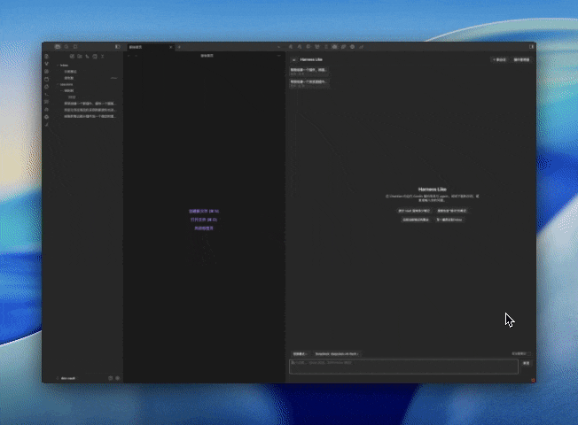
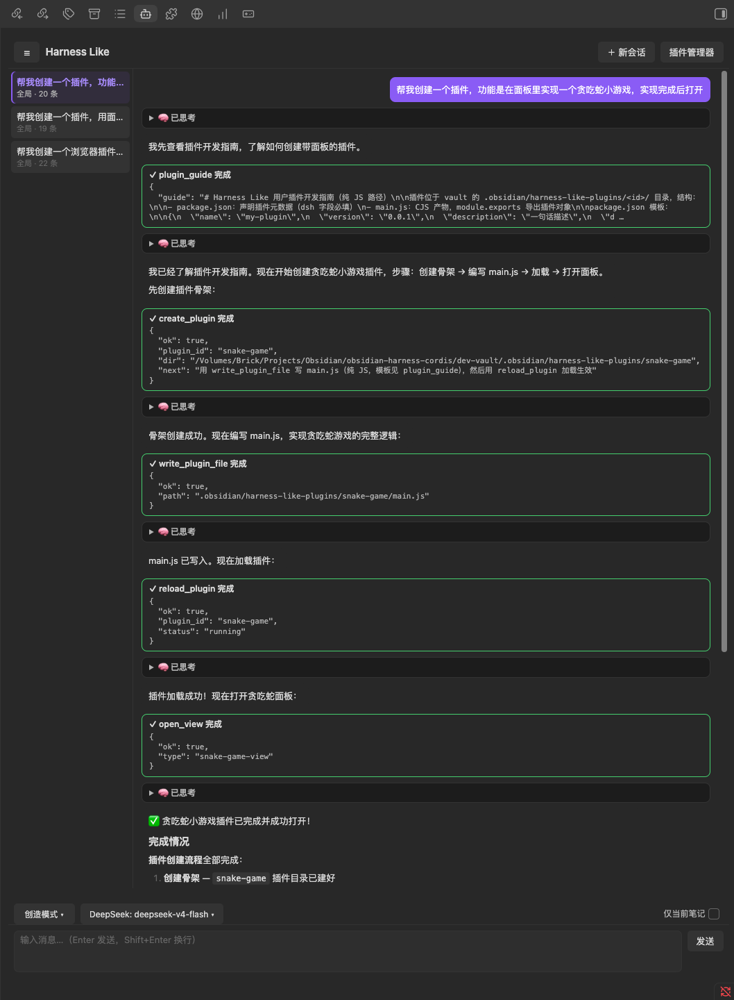
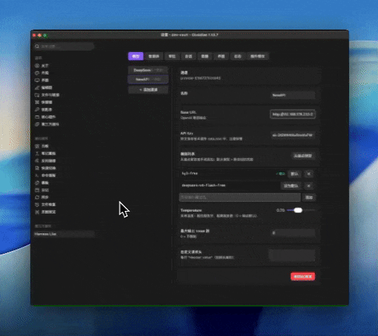
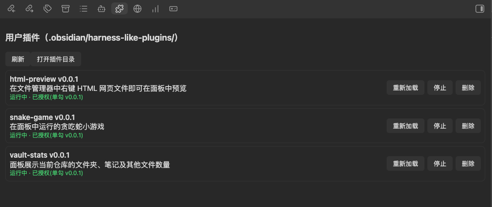

# Harness Like

**An Obsidian implementation inspired by DeepSeek Harness** — run a Cordis plugin system and an AI agent inside Obsidian. The agent reads and writes your notes, calls tools and goes through approvals; you (or the agent) can write your own Cordis plugins to extend Obsidian's commands, tools, panels, ribbon icons, status bar and settings tabs.

> **Status: beta** — core features are complete; the UI supports Chinese & English (and can follow Obsidian's language).
>
> **Desktop only** — Harness Like runs in the Obsidian **desktop** app (macOS / Windows / Linux). Obsidian Mobile is **not** supported.

[English](#en) · [中文](#zh)

---

## English

### What is Harness Like?

Harness Like is an Obsidian implementation inspired by DeepSeek Harness. It embeds a Cordis runtime inside the Obsidian plugin process, exposes Obsidian's APIs as Cordis services, and lets an AI agent read and write your notes through tools — with human approval at every step to keep your data safe. In **Create Mode**, you can build, iterate and reload your own **Cordis plugins** entirely through conversation — whatever you can imagine, you can create.

(Note: these are not Obsidian-native plugins — they are Cordis plugins adapted to Obsidian's extension points provided by Harness Like.)

> Detailed user guide: [**Harness Like Docs**](https://frank6com.github.io/obsidian-harness-like/)

### Screenshots

### Installation

1. From the **official plugin directory**: [Harness Like](https://community.obsidian.md/plugins/harness-like) (desktop only) — in Obsidian: Settings → Community plugins → Browse → search "Harness Like".

2. Manual install (alternative): copy `main.js`, `manifest.json`, `styles.css` from the repository root to `.obsidian/plugins/harness-like/` in your vault.

### Quick Start

1. Open host settings (Settings → Community plugins → Harness Like) → **Models**: enter your API Key (DeepSeek endpoint pre-configured), add models, set a default.
2. Click the bot icon in the ribbon (or run "Open Harness Like Panel").
3. Ask something: *"Count the notes in this vault"* — the agent calls tools with visible cards; writes ask for approval.

### Feature highlights

- **Chat + tools**: streaming, live tool cards, phase indicator, stop/retry;
- **Three agent modes**: Chat (read-only) / Edit (read & write notes) / Create (build plugins) + custom agents with capability whitelists;
- **Approval chain**: per-tool policy → current-note mode → directory whitelist → approval dialog;
- **Create plugins in conversation**: panels, commands, tools, icons, translations — no coding;
- **Multi-provider models** (OpenAI-compatible) with per-model defaults;
- **Session export** to a configurable directory; **backup/migrate** by copying folders;
- **Bilingual UI** (follows Obsidian's language); translation plugins can override strings.

### FAQ

- **Where are my API keys stored?** Plain text in `.obsidian/plugins/harness-like/data.json` — keep it safe.
- **Can I export chats?** Yes — per-session Markdown export, target directory configurable (Settings → Sessions).
- **Can I back up my sub-plugins?** Copy `.obsidian/harness-like-plugins/<id>/` to the same location in the new vault and re-authorize.
- **Is it safe?** Plugins execute only local files; loading requires authorization; writes go through approval. Zero telemetry.

### Docs & support

- User guide & plugin development: [Harness Like Docs](https://frank6com.github.io/obsidian-harness-like/)
- Issues / feature requests: GitHub **Issues** (templates provided)
- Questions & ideas: GitHub **Discussions**

### License

MIT

### For contributors

- Skip this section as a user. Full development docs: [Development](https://frank6com.github.io/obsidian-harness-like/development/index.html).
- Questions? Ask in GitHub **Discussions** or file feature requests in **Issues**.

---

## 中文

### 这是什么？

Harness Like 是 DeepSeek Harness 理念的 Obsidian 实现：在 Obsidian 插件进程内嵌入 Cordis 运行时，把 Obsidian 的 API 暴露为 Cordis 服务，让 agent 可以通过工具读写你的笔记，同时为了保障数据安全全程带人工审批；而在**创造模式**下，甚至能按照你的想法完全通过对话创建、迭代并重载你自己的 **Cordis 插件**，让您的想法言出法随。

`（注意此并非 Obsidian 原生插件，而是通过本插件针对 Obsidian 提供的扩展点适配的 Cordis 插件）`

> 详细使用指南：[**Harness Like 文档站**](https://frank6com.github.io/obsidian-harness-like/)

### 界面截图

### 安装

1. 从**官方插件目录**安装：[Harness Like](https://community.obsidian.md/plugins/harness-like)（仅限桌面端）——Obsidian 内：设置 → 第三方插件 → 浏览 → 搜索 "Harness Like"。

2. 手动安装（备选）：从仓库根目录复制 `main.js`、`manifest.json`、`styles.css` 到 vault 的 `.obsidian/plugins/harness-like/`。

### 快速开始

1. 打开主插件设置（设置 → 第三方插件 → Harness Like）→「模型」：填入 API Key（已预置 DeepSeek 端点），添加模型并设为默认；
2. 点击侧边栏机器人图标（或运行「打开 Harness Like 面板」）；
3. 提问试试：*"统计 vault 里有多少笔记"*——agent 调用工具并展示卡片，写操作会请求审批。

### 功能一览

- **对话 + 工具**：流式输出、工具卡片实时状态、阶段提示条、停止/重试；
- **三种智能体模式**：对话（只读）/ 修编（读写笔记）/ 创造（创建插件）+ 自定义智能体（能力白名单）；
- **审批链**：工具级策略 → 仅当前笔记 → 目录白名单 → 审批弹窗；
- **对话内创建子插件**：面板、命令、工具、图标、翻译——零代码；
- **多模型提供方**（OpenAI 兼容）、模型级默认；
- **会话导出**到可配置目录；**备份/迁移**只需复制目录；
- **中英文界面**（跟随 Obsidian 语言）；翻译插件可覆盖文案。

### 常见问题

- **API Key 存在哪里？** 明文保存在 `.obsidian/plugins/harness-like/data.json`，请注意保管。
- **对话能导出吗？** 可以——按会话导出 Markdown，导出目录可在 设置 → 会话 配置。
- **子插件能备份吗？** 复制 `.obsidian/harness-like-plugins/<id>/` 到新 vault 相同位置，重新授权即可。
- **安全吗？** 插件只执行本地文件；加载需授权；写操作走审批链。零遥测。

### 文档与反馈

- 使用指南与插件开发：[Harness Like 文档站](https://frank6com.github.io/obsidian-harness-like/)
- 问题 / 功能请求：GitHub **Issues**（已配置模板）
- 提问与想法：GitHub **Discussions**

### 许可证

MIT

---

## 面向贡献者

- 使用者可直接跳过本节。完整开发文档见文档站[开发文档](https://frank6com.github.io/obsidian-harness-like/zh/development/index.html)栏目（中文文档位于 /zh/，站点默认英文）。

- 有问题请在 GitHub Discussions 提问，或在 Issues 里提交功能请求。
